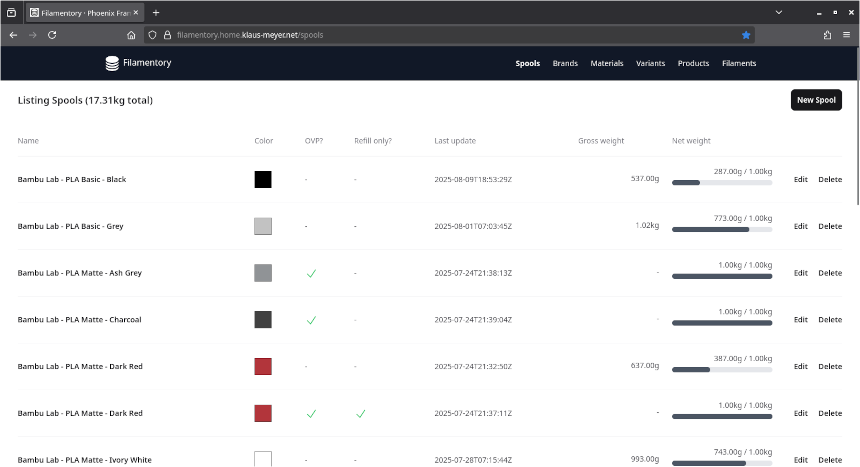

# Filamentory

Playground Phoenix (Elixir) application to keep an inventory of 3d printing filament spools.

## Dev

To start your Phoenix server:

  * Run `mix setup` to install and setup dependencies
  * Start Phoenix endpoint with `mix phx.server` or inside IEx with `iex -S mix phx.server`

Now you can visit [`localhost:4000`](http://localhost:4000) from your browser.
